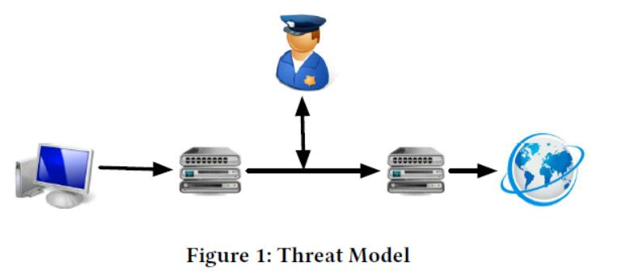

## 二、背景

在本节中，我们提供了GFW采用的基于DPI的审查技术的背景，并讨论了先前提出的绕过策略。

### 2.1 路径上的审查系统

“路径上”审查系统窃听由审查员控制的ISP的路由器，即时复制数据包并与正在进行的流量并行执行分析。 相反，“路径内”审查系统将设备作为路由的一部分，分析流量，然后将其传递到下一跳。 “路径上”系统的能力包括读取封包和注入新封包，而“路径内”系统也可以丢弃和/或修改封包。 对于“路径上”系统，处理时间并不重要，因此，它可以进行更复杂的分析; 对于“路径内”系统，至关重要的是不要执行会导致数据包延迟的繁重分析。 像GFW这样的大规模审查系统通常采用“路径上”设计，以确保极高的吞吐量。

要使用DPI检查应用程序层内容，像GFW这样的审查系统需要首先从数据包中重新组装TCP流。据报道[17]，GFW有一个简化的TCP实现来重建TCP数据流并将其传递给上层进行进一步分析。 GFW能够分析广泛的应用协议（例如，HTTP，DNS，IMAP），并且可以应用其基于规则的检测引擎来检测敏感的应用内容。 TCP连接重置是一种多功能的审查技术。由于GFW的“路径上”性质，它不能丢弃一对终端主机之间的非预期封包。相反，它可以注入数据包来强制连接关闭，或中断连接建立。一旦检测到任何敏感内容，GFW就会向相应的客户端和服务器注入RST（类型1）和RST / ACK（类型2）数据包，来中断正在进行的连接并在一段时间内维持中断（90秒），根据我们的测量）。在此期间，两个终端主机之间的任何SYN数据包都将触发GFW中序列号错误的伪造SYN / ACK数据包，这将阻碍合法握手;任何其他数据包都会触发伪造的RST和RST / ACK数据包，这会破坏连接。

根据以前的工作[3,25]和我们的测量，RST（类型-1）和RST / ACK（类型-2）可能来自通常一起存在的两种类型的GFW实例。 我们遇到过一些单独出现类型1或类型2重置的情况; 因此，我们能够分别测量它们的特征。 类型1复位仅设置RST标志，随机TTL值和窗口大小，而类型2复位设置RST和ACK标志，并循环增加TTL值和窗口大小。

一旦检测到敏感关键字，GFW就会发送一个类型1的RST和三个类型为2的RST / ACK，序列号为X，X + 1460和X + 4380（X是当前服务器端序列号）\*。 请注意，在90秒后续阻塞期间，只有类型2复位需要伪造的SYN / ACK数据包; 此外，当我们将HTTP请求拆分为两个TCP数据包时，只能看到类型2重置。 综上所述，我们推测类型2重置来自更高级的GFW实例或设备。

许多研究都集中在GFW的TCP连接重置上。 徐等人。 [34]执行测量来确定注入RST封包的检查设备的位置。 Crandall等人 [11]采用潜在语义分析来自动生成最新的审查关键字列表。 Park等 [20]在HTTP请求和响应上衡量RST数据包注入对关键字过滤的有效性，并提供了为什么基于HTTP响应的过滤已经停止的见解。 执行TCP连接重置确实存在缺点。 例如，跟踪每个连接的TCP状态并将关键字与大量TCP数据包匹配是很昂贵的。 它也不能完全抵抗绕过。

DNS中毒是GFW使用的另一种常用技术[4,5,19]。 GFW通过UDP和TCP审查DNS请求。 对于带有黑名单域的UDP DNS请求，它只会注入虚假的DNS响应; 对于TCP DNS请求，它转向连接重置机制。 我们的测量还涵盖TCP上的DNS。

### 2.2 NIDS 和审查系统的绕过

Ptacek等 [23]以NIDS构建和维护TCP状态的方式，系统地研究了NIDS的漏洞。 特别地，NIDS为每个实时连接维护TCP控制块（TCB）来跟踪其状态信息（例如，TCP状态，序列号，确认号等）。 目标是复制两个重点上存在的完全相同的连接信息。 但是，在实践中，由于以下因素，这非常具有挑战性：

主机信息的多样性。 由于TCP规范的模糊性和更新，不同的OS实现在处理TCP封包时可能具有非常不同的行为。 例如，当遇到意外的TCP标志组合时，不同的操作系统可能表现不同（因为如何处理这些仍然未在标准中指定）。 另一个例子是RST数据包处理在不同的TCP标准（RFC 793到RFC 5961）上发生了巨大变化。

网络信息的多样性。 NIDS通常无法了解其保护的端点的网络拓扑，因为拓扑本身可能会随时间发生变化。 对于LAN，NIDS可以探测和维护拓扑。 然而，对于审查系统，如果可能的话，监控整个互联网的大规模是极具挑战性的。 此外，这样的系统将不会意识到网络故障或封包丢失。 因此，它无法准确判断数据包是否已到达目的地。

中间设备的存在。 NIDS通常不知道任何一对通信端点之间可能遇到的其他中间设备。 在NIDS处理它们之后，这些中间设备可能会丢弃甚至改变数据包，这使得更难以推断接收器的行为方式。

这一观察推动了TCP重置攻击绕过的工作。 例如，Khattak等 [17]在的TCP和HTTP层手动制定了一套相当全面的针对GFW的绕过策略，并在有限的环境中使用固定的客户端和服务器成功验证了它们。 不幸的是，存在许多未被考虑的因素（例如，在不同的网络路径上可能遇到不同类型的GFW设备，各种中间设备可能通过丢弃精心制作的封包来干扰绕过策略）。

