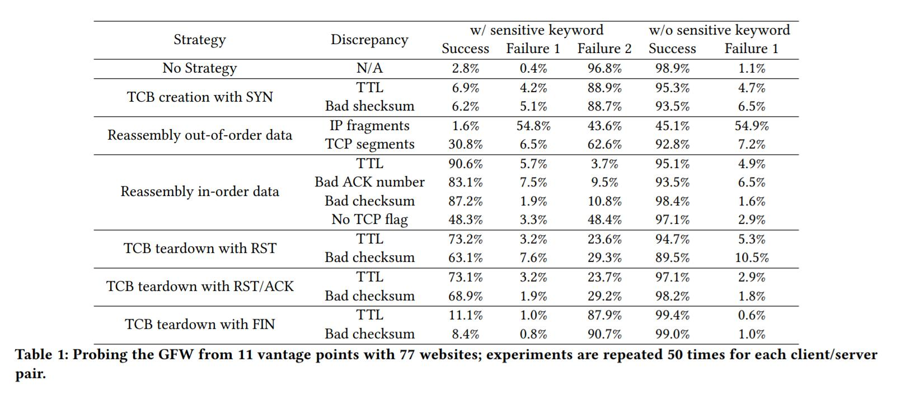
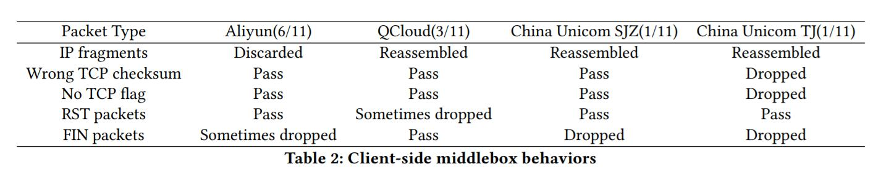

## 三、现有绕过策略的测量

基于Ptacek等人概述的NIDS的基本限制。 [23]，由Khattak等人的GFW建模。 [17]，以及西厢项目的实施[25]，我们将基于TCB操纵的审查绕过策略划分为三个高级类别，即（1）TCB创建，（2）数据重组，以及（ 3）TCB拆解。 在本节中，我们进行深入测量，来评估现有绕过策略的有效性，这些策略是基于目前已知的，在这些类别中的GFW模型而开发的。

### 3.1 威胁模型

威胁模型如图1所示。客户端启动与服务器的TCP连接。 GFW通过创建TCB建立影子连接，并且可以从原始连接读取数据包并将数据包注入到原始连接。 同时，路径上可能有网络中间设备。 我们将客户端和GFW之间的中间设备称为客户端中间设备，将GFW和服务器之间的中间设备称为服务器端中间设备。

### 3.2 现有绕过策略

当前绕过策略（下面列出）的目标是，通过发送特制的数据包，特别是“插入”数据包，使GFW和服务器进入不同的状态（即，变得不同步）。 这些插入数据包是精心设计的，以便它们被预期的服务器忽略（或永远不会到达服务器），但是由GFW接受和处理。

TCB创建。 根据以前的工作[17]，GFW在看到SYN数据包时创建TCB。 因此，客户端可以发送带有伪/错序列号的SYN插入包，以在GFW上创建错误的TCB，然后构建真实连接。 由于其“意外”序列号，GFW将忽略实际连接。 操纵插入数据包中的TTL（生存时间）或校验和，来防止服务器接受第一次注入的SYN - 具有较低TTL值的数据包将永远不会到达预期的服务器并且具有错误校验和的数据包将 被服务器丢弃。

数据重组。数据重组策略有两种情况：（1）无序数据重叠。不同的TCP实现以不同的方式处理重叠的无序数据片段。以前的工作[17]表明，如果GFW遇到两个具有相同偏移和长度的无序IP片段，它更喜欢（记录）前者并丢弃后者。但是，对于具有相同序列号和长度的无序TCP段，它更喜欢后者（详见[17]）。IP分段的这种特性可以如下利用。首先，有意地在有效载荷中留下间隙，并且发送包含随机垃圾数据的具有偏移X和长度Y的片段。随后，发送包含敏感关键字的具有偏移X和长度Y的实际数据来避开GFW（因为期望GFW选择前一个封包）。最后通过发送偏移量为0和长度为X的实际数据来填补间隙。为了利用GFW对TCP段的处理，我们只需切换垃圾数据和实际数据的顺序。

（2）有序数据重叠。 当两个携带IP或TCP片段的有序数据包到达时，GFW和服务器都将接受携带特定片段（由偏移/序列号指定）的第一个有序包。 然后，可以制作包含垃圾数据的插入数据包，来填充GFW的接收缓冲区，同时使服务器忽略它们。 例如，可以制作具有小TTL或错误校验和的插入数据包; 这些数据包要么永远不会到达服务器或被服务器丢弃，而是由GFW接受和处理。

TCB拆解。 根据已知模型，GFW预计会在看到RST，RST / ACK或FIN数据包时拆除它维护的TCB。 可以制作这样的数据包来导致TCB拆解，同时操纵诸如TTL或校验和的字段来确保服务器上的连接是活动的。

### 3.3 实验建立

我们在中国，9个不同的城市（北京，上海，广州，深圳，杭州，天津，青岛，张家口，石家庄）拥有11个有利位置，并跨越3个ISP。其中9个使用云服务提供商（Ailyun和Qcloud），另外两个使用家庭网络（中国联通）。这些服务器选自Alexa全球顶级网站。我们首先筛选出受IP阻止，DNS中毒影响或位于中国境内的网站。出于两个原因，我们排除了默认使用HTTPS的网站。首先，GFW目前没有审查HTTPS流量;因此，我们可以在不使用任何反审查技术的情况下自由访问它们。其次，如果我们使用HTTP访问这些HTTPS网站，他们会发送HTTP 301响应来将我们重定向到HTTPS，并将敏感关键字复制到响应的Location头字段。我们发现某些路径上的GFW设备实际上可以在响应数据包中检测到这一点。这类似于[20]中测量的HTML响应审查。此外，假设部署在特定独立系统（AS）中的GFW设备通常具有相同的类型和版本，并配置相同的策略，我们只从每个AS中选择​​一个IP，以便通过跨越大量AS，使我们的实验多样化。通过应用基于上述规则的过滤器，并删除一些缓慢或无响应的网站，我们最终获得了77个网站（来自所考虑的77个AS）的数据集，Alexa排名在41到2091之间。我们手动验证这些网站是否可（在中国以外）访问，并且一旦包含敏感关键字（即ultrasurf，在HTTP请求中），就会受到GFW的TCP连接重置会受到影响。对于每个策略和网站，我们重复测试50次并找到平均值。由于GFW会在检测到任何敏感关键字时封禁一对主机90秒，因此我们会在必要时在测试之间添加间隔。

### 3.4 结果

我们在2017年4月和5月，衡量现有策略绕过GFW的有效性。结果总结在表1中。表示法：我们在表1中使用以下表示法：成功意味着我们从服务器接收HTTP响应并没有接收来自GFW的重置数据包。 失败1意味着我们没有从服务器收到HTTP响应，也没有从GFW收到任何重置。 失败2意味着我们从GFW接收重置封包，即RST（类型-1）或RST / ACK（类型-2）。结果。 我们的研究结果总结如下。

+   我们发现，可能是因为GFW超载，即使我们不使用任何绕过策略，在检索敏感内容方面仍然有2.8％的成功率。 有趣的是，这种行为最初是在2007年记录的[11]并且一直持续到现在。 

+   我们发现使用SYN创建TCB通常不起作用，并且具有高“失败2”几率（大约89％）。 

+   关于数据重组，我们发现（a）乱序数据重组策略具有高“失败1”和高“失败2”几率，但（b）发送有序数据来预先填充GFW的缓冲区，产生了更高的成功率（通常 > 80％）。 

+   具有FIN的TCB拆除具有高“失败2”速率，而具有RST或RST / ACK的TCB拆除成功率约为70％，但有25％的机会触发来自GFW的重置数据包。

GFW的演变。 我们认为，许多现有策略产生高失败率的主要原因是之前的工作[17]中假定的GFW模型不再有效。 虽然我们推迟了模型如何演变的详细讨论到下一部分，但我们在此指出GFW仍然没有验证“校验和”字段，即具有错误校验和的数据包仍然是一个很好的插入数据包（ 如果没有来自网络中间设备的干扰，GFW考虑它来更新其TCB但服务器丢弃它。 这些策略失败的其他原因，我们将分解结果，并在下面进行分析。

来自客户端中间设备的干扰。 客户端中间设备可能会丢弃我们的插入数据包。 由于我们操纵包字段（例如，错误的校验和，没有TCP标志等），使服务器或服务器端中间设备丢弃插入包，因此客户端中间设备也可以丢弃它们。 因此，这些策略无效，并将导致“失败2”。

另一方面，部署在网络客户端的某些NAT或状态/序列检查防火墙，可能会拦截并接受插入数据包并更改其维护的连接状态。 在这种情况下，后来的数据包不会通过这些中间设备，导致“失败1”。例如，如果RST数据包断开它遍历的客户端中间设备上的连接，则中间设备会阻止该连接上的数据包。

一些客户端中间设备可能会丢弃IP片段（wrt数据重组策略）并导致“失败1”。其他将其缓冲并重新组合成一个完整的IP数据包，这可能会导致“失败2”，具体取决于中间设备的实现。

我们从我们所有的11个有利位置探测客户端中间设备，试图连接我们自己的服务器。 如表2所示，我们发现无法使用阿里云的6个客户端发送IP片段。 人们可以在合理的范围内得出结论，阿里云已经配置其中间设备来丢弃某些类型的IP片段。 我们发现来自其他5个节点的连接遇到了客户端中间设备，它们将IP片段重新组合成包含原始HTTP请求的完整IP数据包; 因此，GFW一定捕获了这些分组。 由于我们发现大多数路由器和/或中间设备干扰IP层操作，我们认为这不是普遍适用于绕过的TCP层操作。

天津中国联通的有利位置有客户端中间设备，丢弃带有错误TCP校验和或不包含TCP标志的数据包; 因此，这两种策略在那个地方并不起作用。 最后，我们发现Aliyun有时会丢弃FIN插入数据包，而QCloud有时会丢弃RST插入数据包。 石家庄和天津（中国联通）的客户都有客户端中间设备，丢弃FIN插入数据包。

失败的其他原因。 两种类型的故障可能还有其他一些原因。 网络或服务器故障虽然很少发生。 我们对失败案例进行了微观研究，并列出了我们在下面观察到的案例。

服务器实现的变化。 我们发现，对于某些服务器实现（例如，3.8之前的Linux版本），服务器有时会接受不带TCP标记的“有序数据重叠策略”下的数据包，从而导致“失败1”。 对于“无序数据重叠策略”，服务器可能会接受垃圾数据并丢弃正确的数据包（就像GFW一样）。

网络动态。 由于路由是动态的并且可能会意外更改，因此插入数据包中用于阻止它们到达服务器的TTL值可能不正确。 因此，它们可能会到达服务器并中断连接（失败1）。 在其他情况下，插入数据包可能无法到达GFW并导致“失败2”。我们还发现网络上的数据包丢失可能会影响插入数据包并导致“失败2”。我们通过每隔20ms重复发送插入包三次，来应对这种动态。

总结。 我们的测量使用真实的Web服务器而不是对照服务器来表示每日Web浏览的情况。 结果证明了由许多因素引起的复杂性（例如，中间设备干扰，服务器多样性，网络多样性等）。 我们用现有的绕过策略展示了整体成功率，并列举了失败案例的可能原因。 为了完全解决导致失败的因素，并量化每个因素的影响，需要进行更深入的分析和对照实验（例如，使用[18]中的对照重放服务器），我们将其留作将来的工作。
