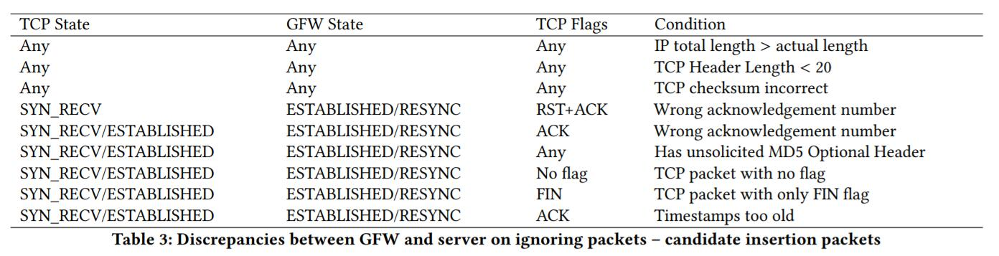

## 五、绕过的新方法

本节中，我们将从两个角度讨论绕过的新机会。 首先，基于GFW的新假设行为，我们提出了新的绕过策略。 其次，我们尝试系统地发现新的插入数据包（除了错误的校验和或小TTL）。

### 5.1 GFW 的去同步

首先，我们描述了一个构建块来对抗GFW中的重新同步状态。 它有助于支持我们的新绕过策略，下面将对此进行讨论。 具体来说，当我们期望GFW处于重新同步状态（这可以被强制）时，我们发送一个插入数据包，其序列号在窗口外。 一旦GFW与该插入封包中的序列号同步，它将感知，该连接的后续合法封包具有窗外的序列号，因此被GFW忽略。 我们说现在GFW与连接失去同步。 请注意，服务器会忽略插入数据包，因为它包含窗口外序列号。

使GFW失去同步极大地有助于改进“TCB拆解”和“有序数据重叠”策略，该策略仍然相对较好地工作但偶尔会遇到不希望的高“失败1”和“失败2”几率。

### 5.2 新的绕过策略

我们的绕过策略主要基于利用新发现的GFW状态。 我们提出了两个新的绕过策略以及对两个现有策略的改进\*。我们在第7节中对这些策略进行了广泛的评估。这两个新策略如下：

> 为简洁起见，我们仅在本节中描述新策略，并将改进策略的详细讨论留给§7。

Resync + Desync。 为了强制GFW进入重新同步状态，客户端在3次握手后发送SYN插入数据包。 随后，客户端发送包含窗口外序列号的1字节数据包，来使GFW去同步。 然后是真实请求。 注意，在接收SYN / ACK封包之前不能发送SYN插入封包，因为GFW最终将基于SYN / ACK的ACK号重新同步预期的客户端序列号。 此外，SYN插入数据包应该采用服务器的预期接收窗口之外的序列号（在较旧的Linux中，这可能导致连接重置）。 较新版本的Linux永远不会接受这样的SYN数据包，无论其序列号如何，只会响应质询ACK [7]。 此外，我们可以在服务器或中间设备干扰的情况下制作具有小TTL的SYN插入数据包。

TCB逆转。如上所述，GFW目前仅审查从客户端到服务器的流量（例如，HTTP / DNS请求），并且除少数情况外，已停止对HTTP响应的审查[20]。当GFW第一次看到SYN / ACK时，它假定源是服务器而目的地是客户端。它创建了一个TCB来反映这种情况。它现在将监视从服务器到客户端的数据包（错误地认为它正在监视从客户端到服务器的数据包）。要利用此属性，客户端将首先发送SYN / ACK插入数据包。它稍后以正常方式执行TCP三次握手。 GFW将忽略这些握手包，因为已存在用于此连接的TCB。请注意，必须谨慎制作SYN / ACK插入数据包。在正常情况下，服务器以RST响应，导致GFW拆除原始TCB。为了解决这个问题，需要在插入封包中使用一个差异（例如，较低的TTL）。另外，我们指出来自客户端的SYN / ACK和后续SYN数据包不会触发GFW进入重新同步状态。

### 5.3 新的插入数据包

所有GFW绕过策略都需要注入额外的数据包或修改现有的数据包来破坏GFW上维护的TCP状态[17,23]。 插入数据包特别方便，因为它们最适合支持针对GFW的绕过策略。 正如§3中所提到的，插入数据包可能很难制作。 它们可能由于诸如网络动态，路由不对称，模糊的网络中间设备以及服务器TCP堆栈的变化等诸多原因而失败。 我们的观察是没有一个插入包是普遍好的。 这促使我们发现附加插入封包，它可能对现有插入封包适合且互补。

发现插入数据包的理想解决方案是为GFW，服务器和网络中间件获取精确的TCP模型，这些模型可以送入自动推理引擎（查看哪种类型的数据包可以作为插入数据包）。 但是，由于GFW是一个只有一个可观察反馈属性（即RST注入）的黑盒子，因此很难准确，完整地推断其内部状态。 我们在§4中推断的演化GFW模型也不太可能完整。 因此，即使有人去掉网络中间设备，问题也非常具有挑战性。

我们的解决方案如下：我们首先使用“忽略”路径分析来建模服务器（例如，流行的Linux和FreeBSD TCP堆栈），而不是试图准确地模拟GFW。 我们的意思是，我们想要识别和推理服务器TCP实现中的点，这会导致它忽略收到的数据包。 具体来说，对于传入数据包，我们会分析在响应中发送ACK时，导致数据包被完全丢弃，或“忽略”的所有可能的程序路径。 第一种情况的示例是具有不正确校验和的封包； 第二种情况可以是具有窗口外序列号的数据包，其触发重复的ACK [21]。 在两种情况下，主机（服务器）的TCP状态（例如，下一个预期的序列号）保持不变。 在我们推导出这个服务器模型后，我们用它来开发针对GFW的探测测试。

对于Linux等开源操作系统，这可以通过类似于PacketGuardian [8]中所做的静态分析来实现。 挑战在于手动识别发生“忽略”事件的所有程序点。 一旦识别出忽略路径，就需要计算导致每条路径的限制，并用于引导针对GFW的测试封包。 一旦我们确定了GFW“接受”数据包的情况，即GFW根据数据包中的信息更新其TCB，我们就可以得出结论，这些数据包是有效的插入数据包（请注意，我们尚未考虑来自网络中间设备的干扰）。

在分析期间，我们只需要考虑仍有可能接收数据的TCP状态，即TCP_LISTEN，TCP_SYN_RECV，TCP_ESTABLISHED。例如，我们省略了TIME_WAIT状态，因为服务器无法再以此状态接收数据，因此理解其忽略路径是徒劳的。在为每个TCP状态生成服务器的忽略路径之后，我们首先生成一系列导致特定TCP状态的数据包；然后，对于为每个忽略路径生成的限制集，我们生成一个或多个测试包（作为候选插入包）。注意，每个忽略路径将产生服务器忽略数据包的原因的唯一原因（例如，错误的校验和或无效的ACK，但不是两者都有）。 Ptacek等 [23]使用类似的方法来研究FreeBSD TCP堆栈，遗憾的是它太旧而不适用。相比之下，我们研究了最新的Linux TCP堆栈，它有许多新的行为。此外，我们通过修剪无关TCP状态中的许多“忽略”路径，诸如TIME_WAIT之类，来改进方法，以及关联“忽略”情况与中间设备行为。

作为演示，我们对Linux内核版本4.4进行了这样的分析。 在表3中，我们列出了确认的情况，其中Linux忽略了数据包，但GFW没有。 我们还尝试将服务器状态与GFW状态进行比较，以使差异更加清晰。 请注意，这是一个比之前的报道更完整的列表[17,23]，证明了我们系统分析的优势。 例如，该发现包括两个新的插入包：

1）服务器在TCP_RECV状态下忽略具有错误ACK号的RST / ACK封包，但GFW将接受这样的封包并将其状态改变为TCP_LISTEN（先前状态终止）或TCP_RESYNC，这取决于GFW模型。

2）服务器忽略带有未经请求的MD5报头的数据包（如果之前没有协商可选的MD5认证），GFW将正常处理该数据包。

可以在具有任何TCP标志的插入数据包中利用MD5报头[15]差异。 例如，这可以用在RST数据包中，来拆除GFW上的TCB，或者用在数据包中来欺骗GFW改变其维护的客户端序列号。 请注意，我们故意省略数据重叠分析（用于处理无序和重叠数据包）的差异，因为已经了解不同的操作系统可能采用不同的策略[23]，因此它可能无法产生安全的插入数据包。

与网络中间件交叉验证。即使根据我们的实验，由分析产生的插入数据包工作得很好，它们也可能不适合中间设备。请注意，IP层错误（例如错误的IP校验和，IP可选标头和IP标头长度）可以在所有TCP标志下用于所有TCP标志，但具有此类属性的数据包通常会被路由器或中间设备丢弃。我们发现唯一有用的特征是“IP总长度”大于“实际数据包长度”（表3中列出）；但是，具有此特征的数据包仍可能被某些中间设备检查和删除。甚至利用TCP层差异的插入数据包（例如与不正确的TCP报头长度，或错误的TCP校验和有关的数据包）仍可能被中间设备丢弃，尤其是在干扰适用于所有TCP状态和标志的情况下。唯一的例外是利用未经请求的MD5标头的插入数据包；我们在实验中遇到的中间设备从未丢弃过这些内容（大概是因为它需要一个有状态的防火墙中间设备才能理解何时应该删除这些数据包）。

插入数据包的其余部分仅对数据包有用。 有效的控制包不能用这些来制作; 例如，当服务器处于ESTABLISHED状态时，即使RST / ACK具有错误的ACK号或旧时间戳，它仍然能够成功重置连接。 根据我们的实验，我们没有遇到过丢弃带有意外的MD5选项，旧时间戳或不正确的ACK号的封包的中间件。

其他TCP堆栈的交叉验证。 很难（如果可能的话）彻底测试所有部署的TCP堆栈的忽略路径。 我们交叉验证了Linux内核4.4与其他几个流行的Linux版本的忽略路径，包括4.0,3.14,2.6.34和2.4.37。 我们在这里总结了结果：

在Linux 3.14中，当连接处于ESTABLISHED状态时，将忽略带有SYN标志的传入数据包，而新的GFW模型将接受它。

在Linux 2.6.34和2.4.37中，当连接处于ESTABLISHED状态时，不会忽略没有设置ACK标志的传入数据包。 相反，实际上将接受没有ACK标志的数据包。 这表明这样的插入数据包不适用于较旧的Linux版本。 

在Linux 2.4.37中，不会忽略带有未经请求的MD5标头的传入数据包。 这是因为较旧的Linux版本尚未实现RFC 2385 [15]中提出的特征。 仔细检查后，可以通过内核编译选项关闭服务器上的MD5选项检查，因此相应的插入数据包实际上可能并不总是有效。

这表明大多数插入数据包适用于各种Linux操作系统，但有一些小的例外（如果遇到的Linux版本太旧）。 由于Linux在服务器市场占主导地位[26]，我们设想在这些插入数据包之上构建的绕过策略将运行良好。 实际上，正如我们在§7中所示，如果我们正确利用这些插入数据包，我们的GFW绕过成功率非常高。 为了发现其他差异并执行自动“忽略路径”分析，我们计划在将来使用选择性符号执行（例如，S2E [9]）。 在我们今后的工作中，我们将对其他Linux版本和操作系统的TCP堆栈进行更严格的分析，包括Windows Server等闭源操作系统。
