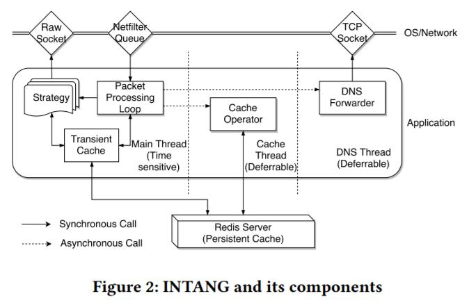

## 六、INTANG

第3节和第4节中描述的所有策略，都集成在统一的测量驱动的一个审查绕过工具中，我们称之为INTANG\*。 该实现包含大约3.3K行的C代码和一些用Python编写的分析脚本。 INTANG被设计为支持附加策略的可扩展框架。 INTANG的组件如图2所示。

> <https://github.com/seclab-ucr/INTANG>

概述。 INTANG的功能分为三个线程，即主线程，缓存线程和DNS线程。 主线程是时间敏感的，所有耗时的操作都被推送到另外两个线程。 主线程运行一个数据包处理循环，它使用netfilter队列[6]拦截某些数据包，并使用原始套接字注入插入数据包。 在处理封包时，它们被保存在队列中，即，在处理完成之前不发送。

当启动新连接时，INTANG根据到特定服务器IP地址的历史测量结果（借助于缓存）选择最有希望的策略。 成功完成试验后，它会将策略ID与连接的四元组一起缓存在内存中。 当它稍后接收到与四元组相关的进一步数据包时，它将调用策略的回调函数来处理传入和传出数据包。 通常，只有一小组特定数据包（例如SYN / ACK数据包，HTTP请求）与每个策略相关并需要监控（如前所述）。

DNS转发器。 DNS线程是一个专用线程，旨在将UDP的DNS请求转换为TCP的DNS请求。如第2.1节所述，TCP层绕过不仅有助于绕过对HTTP连接的审查，还可以支持GFW绕过DNS中毒。为此，在INTANG中集成了一个简单的DNS转发器。它将每个UDP的DNS请求转换为TCP的DNS 请求，并将其发送到未受污染的公共DNS解析器（可能在你国境外）。我们对承载DNS请求和响应的TCP连接应用相同的策略集，来防止GFW在检测到请求中的敏感域时重置连接。主线程拦截传出的DNS UDP请求，这些请求可能包含敏感域名，并将此类请求重定向到执行转发的DNS线程。收到DNS TCP响应后，它将转换回DNS UDP响应并由应用程序正常处理。因此它对应用程序完全透明。我们用Alexa的前100万个域名探测GFW，使用与[12]中相同的方法生成中毒域名列表。
