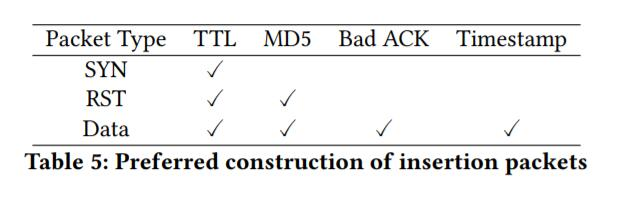

## 七、评估

我们现在使用§5和我们的工具INTANG中描述的新策略，广泛地评估§4中讨论的GFW的假设新行为。我们使用相同的11个有利位置和77个Web服务器，如§3中所述；除非另有说明，否则所有其他测量设置保持不变，来确保结果的一致性。实验是在2017年4月和5月期间进行的。此外，由于GFW不仅审查出站流量，还审查入站流量（均为客户端到服务器流量）\*，我们在你国境外的4个有利位置进行测量，即：在美国，英国，德国和日本，使用亚马逊EC2上的实例，目标是你国境内的。该数据集包括从同一Alexa的前10,000个网站中选择的前33个你国网站，使用与第3.3节相同的方法，除了它们在你国境内。通过双向评估，我们希望检查我们的新假设/策略是否适用于两个方向，并且GFW在两个方向上的实施/策略是相同的。

### 7.1 绕过 HTTP 审查

我们在本小节中评估了4种基本策略。 这些包括基于先前策略的两种改进策略。 这些仍然有效，但有很高的“失败1”和“失败2”几率。 具体来说，它们是带有RST和有序数据重叠的TCB拆解。 另外两个是新策略，即Resync-Desync和TCB Reversal。 请注意，后面这些策略明确地利用了仅存在于演化GFW模型中的新特征。 我们结合了它们与适用于旧GFW模型的上述现有策略，以便击败GFW模型（即，无论是否遇到旧的GFW模型或演化模型，或两者兼顾，目标都是击败GFW）。

使旧策略健壮。 我们通过在其中集成 §4中提到的“去同步数据包”，使TCB拆解与RST策略更加健壮。 我们在RST数据包之后和合法HTTP请求之前发送此去同步数据包，来解决GFW由于RST数据包而进入“重新同步状态”的情况。 我们使用更精心选择的插入数据包，来减少来自中间设备的潜在干扰，或者因为命中了服务器，我们提高了有序数据重叠策略的可靠性。

考虑新旧GFW模型。 我们结合Resync-Desync策略与带有SYN策略的TCB 创建。 后者可以通过导致创建错误的TCB来绕过旧的GFW模型，而前者可以通过首先强制它们进入重新同步状态，来使演化的GFW模型失去同步。 具体来说，如图3所示，我们将发送两个SYN插入数据包（两者都有错误的序列号），一个在合法的三次握手之前，一个在之后，然后是一个去同步数据包，然后是HTTP请求。 注意，合法SYN后面的第一个SYN插入数据包，也会导致演化的GFW进入重新同步状态。 但是，它稍后与SYN / ACK数据包重新同步。 因此，在握手之后我们需要另一个SYN插入封包，使演化的GFW设备“重新转换”到重新同步状态。

我们结合TCB逆转策略与带RST的TCB拆解策略。 具体来说，如图4所示，我们首先从客户端向服务器发送伪SYN / ACK封包，来在演进的GFW设备上创建错误的TCB。 接下来，我们建立合法的3次握手，由于现有TCB这对于进化的GFW无效。 然后我们发送一个RST插入数据包来拆除旧GFW模型上的TCB，然后是HTTP请求。

避免来自中间件或服务器的干扰。 在制作“插入”数据包时，我们明智地选择插入数据包，以免受到来自中间盒的干扰，并且不会在服务器上产生副作用。 我们主要使用基于TTL的插入数据包，因为它通常适用。 这里的关键挑战是选择准确的TTL值来击中GFW，而不是击中服务器端中间设备或服务器。 我们首先使用类似于tcp traceroute的方式测量从客户端到服务器的跳数。 然后，我们从测量的跳数中减去一个小的δ，以尝试阻止插入数据包到达（命中）服务器端中间盒或服务器。 在我们的评估中，我们启发式地选择δ= 2，但是INTANG可以迭代地将其改变来收敛到良好的值。

此外，我们利用新的MD5和旧时间戳插入数据包，允许绕过GFW而不会干扰中间设备或服务器。 表5总结了我们如何为每种类型的TCP数据包选择插入数据包。

结果。 我们首先分析单个绕过策略的结果。 从表4可以看出，所有策略的总体“失败2”率低至1％，这表明（a）我们的新策略在GFW上的成功率很高，（b）我们的假设对于 GFW的演变似乎是准确的。 我们发现失败1和失败2都发生在一些特定的网站/ IP上。 可以假设这是由一些未知的GFW行为或中间设备干扰引起的。 但是，由于这些情况不能持续（非常罕见），我们认为这更可能是由于中间设备干扰造成的。

总的来说，我们发现失败1高几率是整体低成功率的主要原因。 内省的视角表明，由于某些服务器/中间设备接受数据包而不管（错误的）ACK号或MD5选项头的存在，失败1会发生。 此外，由于（a）网络动态或（b）击中服务器端中间设备，所选择的TTL有时是不准确的; 这导致不希望的副作用，增加“失败1”。

此外，我们发现，对于你国以外的有利位置，不幸的是，TTL差异具有明显的缺点。 访问你国的服务器时，GFW设备和所需的服务器通常在几跳之内（有时是共同的）。 因此，插入数据包的TTL值很难收敛，来满足命中GFW而不是服务器的要求。 因此，在这些情况下，使用这种差异可能会导致任何类型的失败。 从表4可以看出，失败1几率和失败2几率的平均值都高于你国境内的有利位置。

最后，由于INTANG可以根据历史结果，为每个服务器IP选择最佳策略和插入数据包，因此我们还在表4中的额外行中，评估了INTANG在你国境内的优势。 它显示了98.3％的平均成功率，展示每个网站和网络路径特定的最佳策略的表现。 这无需进一步优化我们的实现（例如，测量封包丢失和调整插入封包的冗余级别）。

重要结论：虽然我们确实放大了失败的原因，但本节的重要结论是，我们对GFW的新假设行为似乎相当准确，并且新策略在实现绕过GFW的目标方面看似非常有效。 GFW，特别是根据网站和网络路径选择最佳策略时。

### 7.2 绕过 TCP DNS 审查

GFW使用DNS中毒审查UDP DNS请求。它通过注入RST数据包来审查TCP DNS请求，就像它审查HTTP连接一样。因此，我们的绕过策略也可用于帮助绕过TCP DNS审查。如第6节所述，INTANG将UDP DNS请求转换为TCP DNS请求。为了评估我们的策略在绕过TCP DNS审查方面的有效性，我们使用Dyn的2个公共DNS解析器，以及你国的相同的11个有利位置。谷歌的DNS解析器8.8.8.8和8.8.4.4已被GFW IP劫持，因此无法使用。通过使用“改进的TCB拆解与RST策略”重复请求被删除的域（例如，www.dropbox.com）100次，我们得到表6中所示的结果。天津的有利位置成功率低至38 ％和24％。然而，其他地方共同产生了超过99.5％的成功率。有趣的是，我们偶然发现，如果我们通过两个OpenDNS的DNS解析器208.67.222.222和208.67.220.220使用TCP DNS，即使不应用INTANG，我们也不会从任何有利位置受到任何审查。
