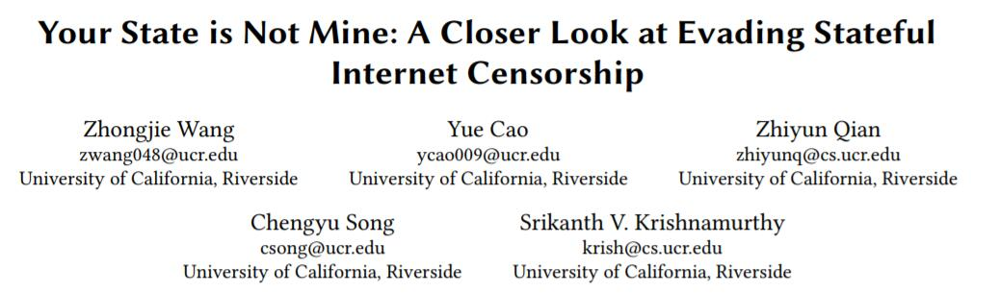

# 你国不是我国：绕过国家级互联网审查



### 摘要

了解你国防火墙（GFW）等国家级互联网审查系统的行为和绕过，已经成为一个引起极大兴趣的研究问题。 绕过的一个方法是开发利用GFW上维护的TCP状态可能不代表终端主机状态的技术。 在本文中，我们可以进行最广泛的关于TCP级GFW绕过技术的测量研究，在你国境内外有几个有利位置，客户可以订阅多个ISP。 我们发现最先进的绕过技术在GFW上不再有效。 我们的研究进一步表明导致这些失败的主要原因是GFWover时间的演变。 此外，其他因素（例如从客户端到服务器的路由中存在中间设备）也会导致先前意外的行为。

我们的测量研究使我们对GFW和新的绕过技术有了新的认识。 对我们新的绕过策略的评估表明，我们的新技术提供了更高的成功率（与先前的方案相比）≈90％或更高。 我们的结果进一步证实了我们对GFW演化行为的新理解。 我们还开发了一个测量驱动工具INTANG，它可以系统地查找并找到适用于服务器和网络路径的最佳策略。 我们的测量结果表明，INTANG可以产生接近完美的绕过率，并且非常有效地帮助各种协议，例如HTTP，DNS TCP和Tor，来避开GFW。

### 关键字

审查绕过，TCP，流量操纵，中国防火墙，INTANG

### ACM 引用格式

```
Zhongjie Wang, Yue Cao, Zhiyun Qian, Chengyu Song, and Srikanth V. Krishnamurthy. 2017. Your State is Not Mine: A Closer Look at Evading Stateful Internet Censorship. In Proceedings of IMC ’17. ACM, New York, NY, USA, 14 pages. https://doi.org/10.1145/3131365.3131374
```
